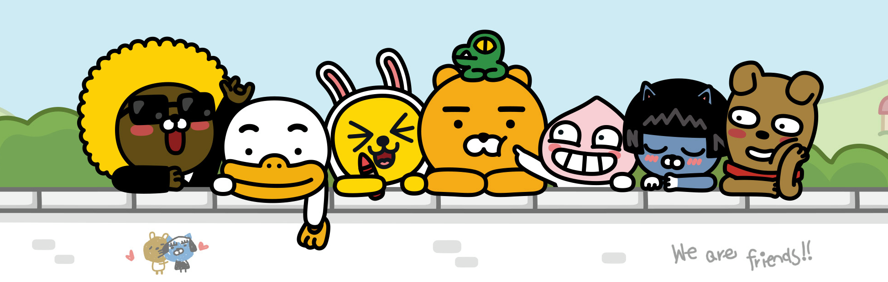

# 카카오 이모티콘 샵

## 프로젝트 소개

게임 데이터 분석가로의 길을 멈추고, 다시 개발 분야로 돌아와 자신감을 찾기 위해 진행한 첫 프론트엔드 프로젝트(클론 코딩)입니다. 개인적으로 카카오(Kakao)에서 운영 b중인 서비스들의 웹사이트 구성이 마음에 들어 그 중 하나인 <a href="https://e.kakao.com/" target="_blank">카카오 이모티콘 샵</a>을 주제로 선택하게 되었고, 프론트엔드를 구성하는 기본 요소인 [HTML/CSS/JS] 세 가지만을 사용해 진행했습니다.

 

[- 프로젝트 사이트 [깃허브]](https://n0hack.github.io/kakao-emoticon-shop)

[- 프로젝트 시리즈 [티스토리]]()

[- 프로젝트 계획 [노션]](https://n0hack.notion.site/78447910a05446b9bb9a0daa86c454d8)

 

## 웹사이트 화면

|  메인   |  스타일  |
| :-----: | :------: |
| ![main] | ![style] |

| 마이페이지 | 서브페이지 |
| :--------: | :--------: |
| ![mypage]  | ![subpage] |

 

## 사용한 기술

|  HTML   |  CSS   | JavaScript | Deploy |
| :-----: | :----: | :--------: | :----: |
| ![HTML] | ![CSS] |   ![JS]    | ![GIT] |

**HTML / CSS**

프론트엔드 프로젝트인 만큼 빠질 수 없는 마크업 언어 HTML과 스타일 언어 CSS를 사용했습니다. 웹사이트를 만들 때 항상 클래스 이름을 짓는 부분에서 많은 시간을 소요하곤 했었는데, <a href="http://getbem.com/" target="_blank">BEM(Block Element Modifier)</a>이라 하는 네이밍 방법론을 알게 되어 이를 적용해 작성했습니다.

**JavaScript**

실제 서비스 중인 카카오 이모티콘 샵을 살펴 보면 배너 이미지가 시간이 지남에 따라 다음 이미지로 전환되고, 무한 스크롤 및 터치 스크롤(마치 모바일에서 이용하는 것 같은) 등이 구현되어 있습니다. 배너 이미지가 자동으로 전환되는 것은 <a href="https://kenwheeler.github.io/slick/" target="_blank">Slick Slider</a> 라이브러리를 사용했으며, 무한 스크롤과 터치 스크롤은 직접 구현했습니다.

**Deploy**

간단하게 만든 웹사이트이기 때문에 배포 역시 처음에는 GitHub Pages를 이용해 보는 것이 좋다는 생각이 들었습니다. 저장소에 프로젝트 등록 이후 갱신되는 데까지는 약간의 시간이 소요되지만, 그래도 무료로 간편하게 이용할 수 있다는 점이 큰 장점같습니다.

 

## 달성한 목표

- [x] 무한스크롤 구현
- [x] 이미지 지연로딩
- [x] 드래그 스크롤 직접 구현

 

## 아쉬운 점

BEM 네이밍

프로젝트 구조

깔끔하지 않은 코드

데이터 (무한스크롤)

SlickSlider 라이브러리

## 저작권

프로젝트에 사용된 이미지는 [카카오 이모티콘샵](https://e.kakao.com/)에서 실제로 사용 중인 이미지입니다. 따라서 모든 저작권은 [카카오(Kakao)](https://www.kakaocorp.com/page/)에 있습니다.

<!-- References -->

[main]: ./docs/home.png
[style]: ./docs/style.png
[hot]: ./docs/hot.png
[new]: ./docs/new.png
[mypage]: ./docs/mypage.png
[subpage]: ./docs/subpage.png
[html]: ./docs/html.svg
[css]: ./docs/css.svg
[js]: ./docs/javascript.svg
[git]: ./docs/github.svg
